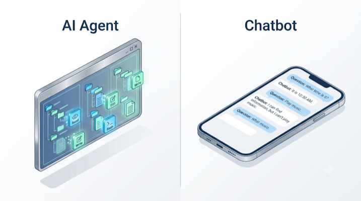
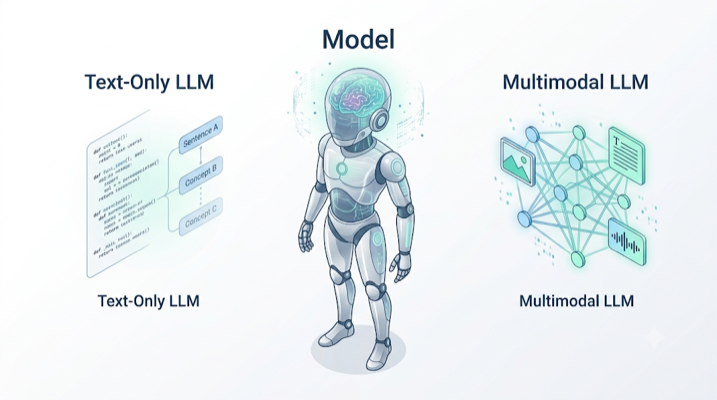
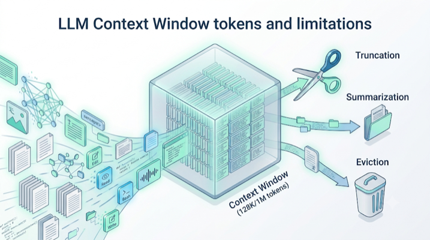
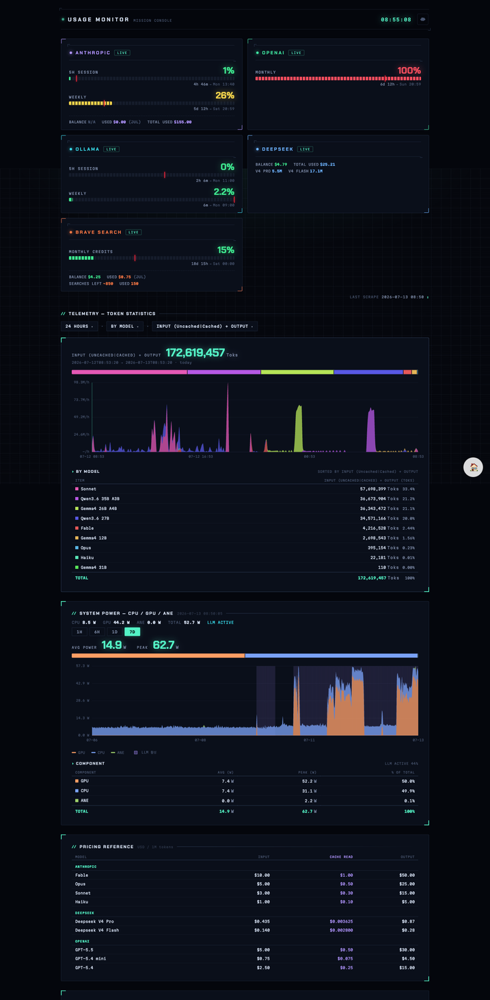
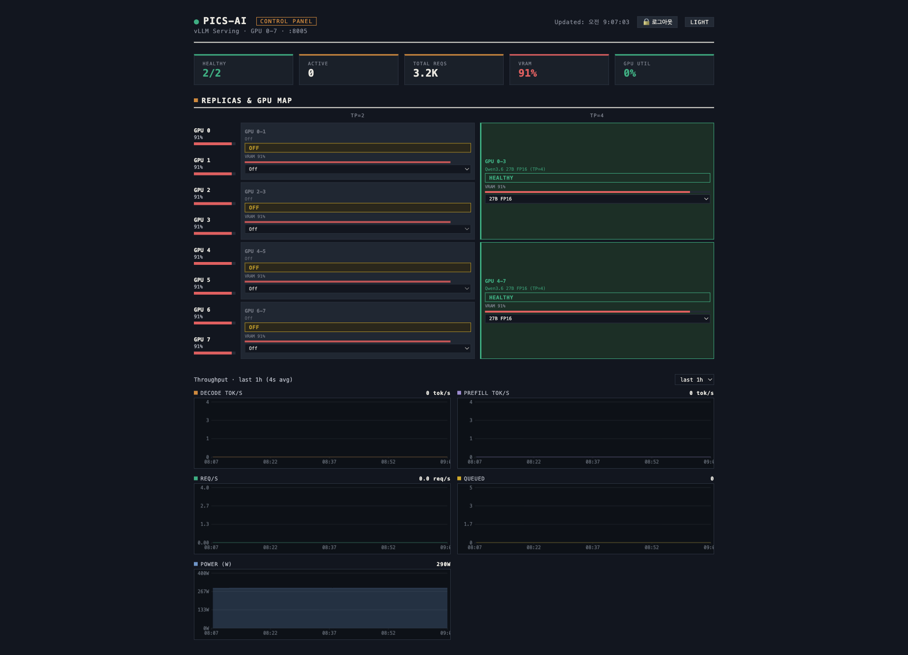

# AI Coding Agents Guide

Claude Code, Pi, OpenCode 가이드 (부서 폐쇄망 인프라 한정 설명, 2026년 7월 13일 기준)
엄밀한 설명보다는 우리 파트에서 사용 가능한 AI Agent를 다루기 위한 최소 설명으로 구성되어 있습니다.

---

## 목차

- [1. AI Agent](#1-ai-agent)
  - [1.1. AI Agent](#11-ai-agent)
  - [1.2. Model](#12-model)
  - [1.3. Context Window](#13-context-window)
- [2. Claude Code](#2-claude-code)
  - [2.1. Claude Code](#21-claude-code)
  - [2.2. 슬래시 명령어](#22-슬래시-명령어)
  - [2.3. Skills](#23-skills)
  - [2.4. @ 참조와 CLAUDE.md](#24--참조와-claudemd)
- [3. Pi](#3-pi)
  - [3.1. Pi](#31-pi)
  - [3.2. 슬래시 명령어](#32-슬래시-명령어)
  - [3.3. Skills](#33-skills)
  - [3.4. @ 참조와 AGENTS.md](#34--참조와-agentsmd)
- [4. OpenCode](#4-opencode)
  - [4.1. OpenCode](#41-opencode)
  - [4.2. 슬래시 명령어](#42-슬래시-명령어)
  - [4.3. @ 참조와 AGENTS.md](#43--참조와-agentsmd)

## 1. AI Agent

### 1.1. AI Agent
- 챗봇은 채팅창 안에 머무르지만 코드 에이전트는 터미널과 파일 시스템을 통해 개발 작업을 수행합니다.
- `Read`, `Write`, `Edit`, `Bash` 등 다양한 도구를 사용합니다.

### 1.2. Model
- AI Agent를 얘기할 때 Model이란 Large Language Model(LLM)을 의미합니다.
- LLM은 다시 Text-Only와 Multimodal LLM으로 나뉩니다.
- 챗봇과 대화할 때 다양한 모델을 선택할 수 있습니다. 마찬가지로 같은 에이전트라도 다른 모델로 구동할 수 있습니다.
- 일반적으로 에이전트를 몸에 비유하고 모델을 뇌에 비유합니다. 또 다른 비유로, 에이전트가 비행기나 선박이라면 모델은 그것들을 구동하는 엔진이라고 볼 수 있겠죠.

### 1.3. Context Window
- Model이 수용할 수 있는 내용(Context Window)은 한계가 있습니다.
- 이 수용 한계는 토큰(token)의 숫자로 정의됩니다. (128K, 256K, 1M 등)

> *"Context Window가 한계에 도달하면 잘라내기(Truncation), 요약(Summarization), 제거(Eviction) 등의 방법으로 대응해야 합니다."*

## 2. Claude Code

### 2.1. Claude Code
- 우리 파트에서는 `claude-adtco`를 입력해서 실행 가능합니다. 2026년 7월 13일 기준 `r72` 버전 이하라면, `claude-adtco --restart`로 패치하거나, 실행중인 모든 Claude Code를 종료한 뒤, `claude-adtco` 입력 시 최신 버전으로 업데이트됩니다.
- 세 에이전트 중 가장 복잡하고 정교합니다. 수많은 도구와 부가기능을 통해 모델의 작업을 돕습니다. 단, Anthropic 모델에 최적화되어 있으므로 서드파티 모델 사용 시 도구 사용 성공률이 낮아지며 일부 도구가 호환되지 않습니다.

> *"`claude-adtco --restart` 실행 시 종료된 세션은 해당 터미널에서 `claude-adtco -c`로 재개하면 됩니다."*

### 2.2. 슬래시 명령어
`/model  ` 모델을 변경합니다. (`GLM-5.2`, `Kimi-K2.7-Coder`, `Qwen3.5-397B-A17B`)

`/rewind ` 선택한 과거 시점으로 회귀합니다. Claude Code가 Write, Edit 도구로 수정한 파일을 되돌릴지 선택할 수 있습니다.

`/compact` 지금까지의 대화 내용을 요약합니다.

`/clear  ` 지금까지의 대화 내용을 초기화합니다.

`/tui    ` TUI 설정을 변경합니다.

### 2.3. Skills
`/frontend-design` 문서 작성 등 전반적인 디자인 개선

`/dataviz` 표, 차트, 그래프 그리기

### 2.4. @ 참조와 CLAUDE.md
- 프롬프트에 `@`를 입력하면 파일·디렉토리를 퍼지 검색으로 참조할 수 있으며, 해당 내용이 컨텍스트에 포함됩니다.
- 프로젝트 루트의 `CLAUDE.md`는 세션 시작 시 자동으로 로드되는 지침 파일입니다. 코딩 컨벤션, 자주 쓰는 명령어, 주의사항 등을 기록해두면 매 세션 반복 설명이 필요 없습니다.
- 모든 프로젝트에 적용할 전역 지침은 `~/.claude/CLAUDE.md`에 둡니다.
- `CLAUDE.md` 안에서 `@경로` 문법으로 다른 .md 파일을 불러올(import) 수 있습니다.

## 3. Pi

### 3.1. Pi
- 우리 파트에서는 `pi-adtco`를 입력해서 실행 가능합니다.
- `Read`, `Write`, `Edit`, `Bash` 네 가지 도구만 기본으로 주어진 미니멀한 코딩 에이전트입니다.

### 3.2. 슬래시 명령어
`/model  ` 모델을 변경합니다. (Claude Code의 `/model`과 유사)

`/tree   ` 선택한 과거 시점으로 회귀합니다. (Claude Code의 `/rewind`와 유사)

`/compact` 지금까지의 대화 내용을 요약합니다. (Claude Code의 `/compact`와 유사)

`/new    ` 지금까지의 대화 내용을 초기화합니다. (Claude Code의 `/clear`와 유사)

### 3.3. Skills
`/skill:pi-subagents` 서브에이전트 호출

### 3.4. @ 참조와 AGENTS.md
- 프롬프트에 `@`를 입력하면 파일을 퍼지 검색으로 참조할 수 있습니다. (Claude Code의 `@` 참조와 유사)
- 실행 시 `pi @파일 "질문"` 형태로 파일을 첨부할 수도 있습니다.
- 지침 파일로 `AGENTS.md`를 로드하며, 없으면 `CLAUDE.md`를 대신 읽습니다. 현재 디렉토리 → 상위 디렉토리 → 전역(`~/.pi/agent/AGENTS.md`) 순으로 탐색합니다.
- 지침 파일 수정 후에는 `/reload`를 실행하거나 Pi를 재시작해야 반영됩니다.

## 4. OpenCode

### 4.1. OpenCode
- 우리 파트에서는 강화판인 Oh-My-OpenCode를 사용하고 있으며, `omo-adtco`를 입력해서 실행 가능합니다.
- OpenAI Compatible API와 호환되며, Pi보다 좀 더 다양한 기능을 포함한 코딩 에이전트입니다.

### 4.2. 슬래시 명령어
`/models ` 모델을 변경합니다. (Claude Code의 `/model`과 유사)

`/undo   ` 마지막 메시지와 파일 변경을 되돌립니다. (Claude Code의 `/rewind`와 유사, `/redo`로 복구 가능)

`/compact` 지금까지의 대화 내용을 요약합니다. (Claude Code의 `/compact`와 유사)

`/new    ` 지금까지의 대화 내용을 초기화합니다. (Claude Code의 `/clear`와 유사)

### 4.3. @ 참조와 AGENTS.md
- 프롬프트에 `@`를 입력하면 파일을 퍼지 검색으로 참조할 수 있습니다. (Claude Code의 `@` 참조와 유사)
- 지침 파일로 프로젝트 루트의 `AGENTS.md`를 로드하며, 없으면 `CLAUDE.md`를 대신 읽습니다. (Claude Code에서 갈아탈 때 그대로 호환)
- 모든 프로젝트에 적용할 전역 지침은 `~/.config/opencode/AGENTS.md`에 둡니다.
